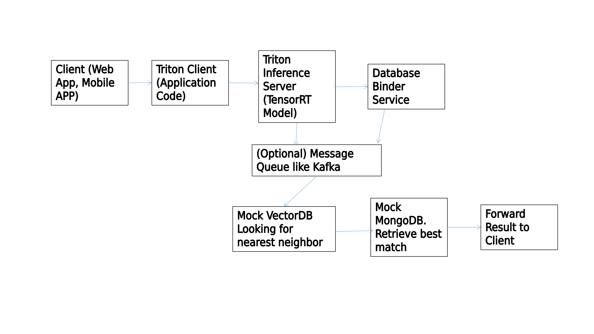

# Preparing TensorRT-Triton Server for Language-Based Inference

This guide provides a comprehensive overview of setting up a TensorRT-Triton server for language-based inference, specifically leveraging the latest GPT models from TensorRT-LLM. We'll cover the essential steps to build model engines and configure the server to handle inference requests, including the quantization pipeline. This guide focuses on practical steps rather than delving deep into the theoretical details of each component.

---

## 1. Download GPT2 Model from Hugging Face

We'll start by downloading a pre-trained GPT2 model from Hugging Face. Pre-trained models like these are invaluable as they have learned intricate patterns from vast datasets, enabling developers to utilize advanced AI capabilities without the extensive time and resources required for training complex models from scratch.

**Model Link:** [https://huggingface.co/openai-community/gpt2-medium](https://huggingface.co/openai-community/gpt2-medium)

---

## 2. Download and Build TensorRT-LLM

TensorRT-LLM is built upon NVIDIA's TensorRT deep learning optimizer, specifically designed for Large Language Models (LLMs). It offers a Python API to define LLMs and compile them into highly optimized "TensorRT engines." These engines incorporate cutting-edge optimizations such as:

* Custom CUDA Kernels
* Quantization
* Layer Fusion
* In-Flight Batching
* Paged Attention
* Speculative Decoding
* Multi-GPU and Multi-Node Support

**Note:** You can skip building the TensorRT-LLM container in this step, as it will be included in **Step 3** when building the `tensorrtllm-backend` container.

**Source Code and Guide:** [https://github.com/NVIDIA/TensorRT-LLM](https://github.com/NVIDIA/TensorRT-LLM)

**Building Docker:** [https://nvidia.github.io/TensorRT-LLM/installation/build-from-source-linux.html](https://nvidia.github.io/TensorRT-LLM/installation/build-from-source-linux.html)

---

## 3. Download and Build TensorRT-LLM Backend Container

The `tensorrtllm_backend` is a specialized plugin for NVIDIA Triton Inference Server, enabling it to efficiently serve LLMs optimized with NVIDIA TensorRT-LLM. It's a crucial component for deploying high-performance, scalable LLM inference solutions on NVIDIA GPUs.

This `tensorrtllm-backend` build process includes TensorRT-LLM as a dependency, so you can skip **Step 2** and simply select the correct tag and branch for TensorRT-LLM within the `tensorrtllm-backend` repository.

**Caution:** It is critical that the **version of Triton Inference Server matches the `tensorrtllm-backend` version.**

**Source and Container Build Guide:** [https://github.com/triton-inference-server/tensorrtllm_backend](https://github.com/triton-inference-server/tensorrtllm_backend)

---

## 4. Download and Build Triton Inference Server Container

NVIDIA Triton Inference Server is an open-source serving software developed by NVIDIA, designed to streamline the deployment and execution of AI models in production environments. It simplifies serving machine learning and deep learning models at scale.

**Source and Container Build Guide:** [https://github.com/triton-inference-server/server](https://github.com/triton-inference-server/server)

---

## 5. Convert Weights from Hugging Face Transformers to TensorRT-LLM Format

To convert the Hugging Face Transformers GPT model to TensorRT-LLM format, use the `convert_checkpoint.py` script located in the TensorRT-LLM examples. For the `model_dir` value, use the path `/prepare-triton-server/input-engine`.

**Script Location:** [https://github.com/NVIDIA/TensorRT-LLM/blob/main/examples/models/core/gpt/README.md](https://github.com/NVIDIA/TensorRT-LLM/blob/main/examples/models/core/gpt/README.md)

---

## 6. Build TensorRT Engines

Using the output from **Step 5**, generate the GPT engine via the `trtllm-build` command from the TensorRT-LLM repository. This command allows for various configurations, such as `dtype` for data type and `tp` for tensor parallelism, accommodating different hardware architectures. The output folder, for example, `/prepare-triton-server/output-engine`, will be used later within the Docker container to prepare the model for inference.

**Command Description for GPT Model:** [https://github.com/NVIDIA/TensorRT-LLM/blob/main/examples/models/core/gpt/README.md](https://github.com/NVIDIA/TensorRT-LLM/blob/main/examples/models/core/gpt/README.md)

---

## 7. Prepare Model for Inference

Copy the output from **Step 6** (the `/prepare-triton-server/output-engine` folder) to the `/all_models/inflight_batcher_llm/tensorrt_llm/1/` directory within the container so that Triton Server can locate it.

---

## 8. Prepare Configuration Files for Inference Steps

This step involves preparing the `.pbtxt` configuration files for various stages of inference, including preprocessing, ensemble, `tensorrt_llm`, and post-processing. Each LLM model requires its own configuration files, tailored to the number of inputs and outputs at each stage, with correct data types.

While most models in the TensorRT-LLM repository don't have default configuration files, the GPT model's configuration file is available at: [https://github.com/NVIDIA/TensorRT-LLM/tree/main/triton_backend/all_models/gpt](https://github.com/NVIDIA/TensorRT-LLM/tree/main/triton_backend/all_models/gpt).

It's necessary to modify certain parameters within the `.pbtxt` files for each stage. You can either use the `fill_template.py` script or manually update the values. Parameters to adapt are typically in the `${}` format and should be replaced with valid values. The location of these configuration files within the container is `/all_models/inflight_batcher_llm/tensorrt_llm`.

For more information on Triton Inference Server, refer to:

* [https://github.com/triton-inference-server/tutorials](https://github.com/triton-inference-server/tutorials)
* [https://docs.nvidia.com/deeplearning/triton-inference-server/user-guide/docs/tensorrtllm_backend/README.html#launch-triton-tensorrt-llm-container](https://docs.nvidia.com/deeplearning/triton-inference-server/user-guide/docs/tensorrtllm_backend/README.html#launch-triton-tensorrt-llm-container)

---

## 9. Run the Triton Server

After preparing the model and configuration files, you can now run the Triton Server to accept input and provide output.

```bash
python3 /opt/scripts/launch_triton_server.py --model_repo <path/to/model>
Expected Directory Structure
After generating the engines and configuring the files, your directory structure should resemble the following:

/all_models/inflight_batcher_llm/tensorrt_llm/
├── ensemble/
│   └── 1/
│       └── config.pbtxt
├── preprocessor/
│   └── 1/
│       ├── config.pbtxt
│       ├── model.py
│       └── requirements.txt
├── tensorrt_llm/
│   └── 1/
│       ├── config.pbtxt
│       ├── rank0.engine  # Path to engine from Step 6
│       └── config.json
└── postprocessor/
    └── 1/
        ├── config.pbtxt
        ├── model.py
        └── requirements.txt
```

# Preparing Triton Server for Visual Language Model (VLM) Inference

Building upon our knowledge of handling language-based input with Triton Server, we will now extend this principle to manage both visual and textual input for Visual Language Models (VLMs). Our goal is to leverage a Large Multimodal Model (LMM) capable of understanding and generating content based on both images and text. We will utilize the CLIP model for the vision component and MiniLM-Tex for the text component. We'll need to generate TensorRT engines for both of these models.

## 1. Prepare CLIP Vision and Text Engines
After downloading both models, you can generate ONNX files to standardize the neural network representation. Use the provided scripts: prepare-triton-server/engines/vision_encoder/vision_encoder.py and prepare-triton-server/engines/text_encoder/text_encoder.py to generate these ONNX files. Subsequently, trtexec can be used to generate TensorRT engines, with various parameters available for quantization.

You'll also need to create two config.pbtxt files for both the text and vision engines, which will be used later by the TensorRT-Triton Server.

```bash
/prepare-triton-server/engines/
├── vision_encoder/tensorrt_quantized_models/engines/
│   ├── config.pbtxt
│   └── 1/
│       └── clip_vision_encoder_quantized_int8.engine
├── text_encoder/tensorrt_quantized_models/engines/
│   ├── config.pbtxt
│   └── 1/
│       └── llava_llm_quantized_engine/
└── llava_ensemble/
    └── config.pbtxt
```

## 2. Ensemble Vision and Text Engines into a VLM Model
With both vision and text engines, and their respective .pbtxt configuration files in place, we can construct an ensemble to handle both text and vision as input, ultimately providing text output to be forwarded to a database for finding the best match.

```bash
/prepare-triton-server/engines/
└── llava_ensemble/
    └── config.pbtxt
```

## 3. Mocking Mongo-DB and Vector-DB
After the VLM inference, we will query a database to find the best match to send an answer to the client.

```bash
/prepare-triton-server/database/
├── code/mock-database/mock-mongo.py
└── code/mock-database/mock-vector.py
```

# Cline send request to triton-server and receive result

**Step-by-Step Workflow:**

You can use this tutorial page for getting more familiar with triton client. https://github.com/triton-inference-server/client/tree/main

### 1- Client Initiates Request:

A client application (e.g., a web application, mobile app, or another backend service) needs an AI inference.

It sends a request to your Triton Client application (your custom application code). This request might contain input data (e.g., an image, text) perhaps a unique request_id.

### 2- Triton Client Sends Inference Request:

Your Triton Client application acts as an intermediary. It receives the client's request, pre-processes the input data (if necessary, e.g., resizing images, tokenizing text), and formats it into the appropriate tensor format for Triton.

Crucially, the Triton client should generate or receive a unique request_id that it associates with this specific inference. This request_id will be passed through to the database and will be used by the client later to retrieve its result.

### 3- Triton Inference Server Processes Request:

The Triton Inference Server receives the inference request, which contains the input data and potentially metadata like the request_id.

It loads and executes the specified TensorRT model (or other framework models).

The model performs the inference and generates an output (e.g., class probabilities, bounding box coordinates, generated text).

### 4- Triton Output to Database Binder Service:

After the Triton Inference Server produces its output, this output does not go directly back to the original client immediately.

Instead, your Triton Client application (which initiated the request) receives the inference result from Triton.

This is where the "binding" happens: Your Triton Client application takes the received output, along with the original request_id and any relevant input metadata, and sends it to a Database Binder Service.

### 5- Implementation Options for Database Binder:

Direct Database Write (Simpler, lower throughput): The Triton Client application itself connects directly to the database and inserts the inference result. This is suitable for moderate loads.

Message Queue (Recommended for high throughput and decoupling): The Triton Client publishes the inference result (along with request_id and metadata) to a message queue (e.g., Kafka, RabbitMQ, Redis Streams). A separate, dedicated Database Ingestor/Binder Service then subscribes to this queue, consumes the messages, and writes them to the database. This provides:


### 6- Client Retrieves Results

Since the original client did not get an immediate response, it needs a mechanism to retrieve the result from the database.

**Polling**: The client can periodically poll a Database Query Service/API using its request_id until the result is available in the database.

**Webhooks/Push Notifications:** For more real-time scenarios, the Database Binder Service (or a separate post-processing service) could trigger a webhook or send a push notification (e.g., via WebSockets, server-sent events, mobile push notifications) back to the client once the result is written and ready.

**Long Polling:** A hybrid approach where the client makes a request and the server holds the connection open until the result is ready or a timeout occurs.

### 7- Database Query Service/API:

This is a dedicated service (e.g., a simple REST API built with Flask, FastAPI, Node.js, Go) that exposes an endpoint like /results/{request_id}.

When the client queries this endpoint, the service fetches the corresponding record from the database using the request_id and returns the infere


re.


# Adding load balancer together with container to handle more request in parallel
To scale inference throughput and handle a higher volume of parallel requests, a load balancing solution is essential for NVIDIA Triton Inference Server. This project addresses this by deploying multiple Triton instances within Docker containers, fronted by an Nginx server. The container configurations, defined in YAML, will enable precise allocation of distinct GPUs to each Triton instance, maximizing parallel processing 

```bash
version: '3.8'
services:
  triton-server-1:
    image: nvcr.io/nvidia/tritonserver:24.05-py3 # Use a recent version
    container_name: triton-server-1
    # Use --gpus all if you want this instance to use all GPUs,
    # or specify devices: ['device=0'] for a specific GPU
    deploy:
      resources:
        reservations:
          devices:
            - driver: nvidia
              count: 1 # Assign 1 GPU to this container
              capabilities: [gpu]
    environment:
      # Optional: limit visible devices if using multiple GPUs per host
      # CUDA_VISIBLE_DEVICES: "0"
    volumes:
      - ./model_repository:/models # Mount your models
    command: ["tritonserver", "--model-repository=/models", "--log-verbose=1"]
    ports:
      - "8000" # Expose HTTP port for internal LB access
      - "8001" # Expose gRPC port for internal LB access
      - "8002" # Expose Metrics port for internal LB access
    networks:
      - triton_net

  triton-server-2:
    image: nvcr.io/nvidia/tritonserver:24.05-py3
    container_name: triton-server-2
    deploy:
      resources:
        reservations:
          devices:
            - driver: nvidia
              count: 1 # Assign another GPU to this container
              capabilities: [gpu]
    environment:
      # CUDA_VISIBLE_DEVICES: "1" # If multiple GPUs available and you assign different GPUs
    volumes:
      - ./model_repository:/models
    command: ["tritonserver", "--model-repository=/models", "--log-verbose=1"]
    ports:
      - "8000"
      - "8001"
      - "8002"
    networks:
      - triton_net

  # Nginx as an HTTP Load Balancer
  nginx-lb:
    image: nginx:latest
    container_name: nginx-lb
    volumes:
      - ./nginx.conf:/etc/nginx/nginx.conf:ro # Mount Nginx configuration
    ports:
      - "80:80" # Expose Nginx on host port 80
      - "443:443" # Optional: For HTTPS
    depends_on:
      - triton-server-1
      - triton-server-2
    networks:
      - triton_net

networks:
  triton_net:
    driver: bridge
```

### We use this script to configure Ngix serve to handle request forwarding to different server.


```bash
worker_processes 1;

events {
    worker_connections 1024;
}

http {
    upstream triton_backend {
        server triton-server-1:8000; # Use service name as hostname
        server triton-server-2:8000;
    }

    server {
        listen 80;
        server_name localhost;

        location / {
            proxy_pass http://triton_backend;
            proxy_set_header Host $host;
            proxy_set_header X-Real-IP $remote_addr;
            proxy_set_header X-Forwarded-For $proxy_add_x_forwarded_for;
            proxy_set_header X-Forwarded-Proto $scheme;

            # Triton specific headers for large requests/responses
            client_max_body_size 0; # Allow unlimited request body size
            proxy_buffering off; # Disable buffering for streaming

            # Increase timeouts for potentially long inference requests
            proxy_read_timeout 300s;
            proxy_connect_timeout 300s;
            proxy_send_timeout 300s;
        }

        # Optional: Health check endpoint for the load balancer itself (not Triton)
        location /health {
            return 200 'healthy';
            add_header Content-Type text/plain;
        }
    }
}
```


